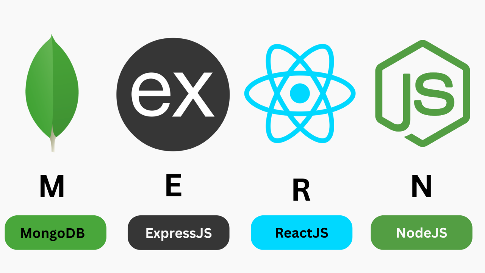

# Desarrollo Web Full Stack Online Oct_24

### JS, ES6, Frontend, Backend, testing, Deploy. Stack MERN: Mongo, Express, React, Node.js

 &nbsp;

## ¿Qué vas a aprender?

A dominar las tecnologías Front-end y Back-end en desarrollo web.
A crear interfaces de usuario atractivas.
A gestionar eficientemente las bases de datos y los servidores.
A profundizar en las tecnologías y los lenguajes de programación más utilizados en empresas para desarrollo web.
Aprende sobre HTML; CSS, JavaScript, Express, Node JS, React y bases de datos con MongoDB y SQL.
 

###### top

# 🗺️ Navegación rápida

- **HTML | CSS | JS Fundamentals** [Sprints 1 y 2](#ramp-up)
- **JS Avanzado** [Sprint 3 a 8](#js_avanzado)
- **Backend** [Sprints 9 a 14](#backend)
- **Frontend** [Sprint 17 a 20](#frontend)
- [**Clases de refuerzo**](#clases-de-refuerzo)
   

# 📚 Temario

##### Ramp Up

### 🚀 SPRINT 1. HTML y CSS

### [HTML Fundamentos](./01_Ramp_Up/01_html/)

- Lenguaje de marcado y lado del cliente
- Encabezados, párrafos, formato de texto, citas, listas, comentarios
- Enlaces, tablas y etiquetas multimedia
- Formularios y etiquetas semánticas

### [CSS](./01_Ramp_Up/02_css/)

### 1. Introducción a CSS

- ¿Qué es CSS?
- Un elemento en CSS
- Conectando HTML y CSS
- Selectores, modelo de cajas y posición
- Display & Flexbox

### 2. Flexbox y Media Queries

- Mobile first y media queries
- Transform, transiciones y animaciones

### 🚀 SPRINT 2. [JS Fundamentos](./01_Ramp_Up/03_js/)

- Variables y tipos de datos
- Operadores, Arrays y Bucles
- Funciones, Condicionales y Objetos

##### [Volver arriba](#top)

##### Core

### [JS_Avanzado](./02_JavaScript_Avanzado)

### 🚀 SPRINT 3. [JS Avanzado 1](./02_JS_avanzado/sprint_3/)

- Terminal y comandos
- Git y GitHub
- DOM, nodos y eventos
- SetAttribute

### 🚀 SPRINT 4. [JS Avanzado 2](./02_JS_avanzado/sprint_4/)

- Funciones puras y arrays
- Métodos de array
- Fetch

### 🚀 SPRINT 5. [JS Avanzado 3](./02_JS_avanzado/sprint_5/)

- Destructuring
- Spread Operator y Rest Operator
- Bucles avanzados
  - Foreach, Map, Reduce, Filter
- localSotrage y sessionStorage
- Métodos de objeto

### 🚀 SPRINT 6. [JS Avanzado 4](./02_JS_avanzado/sprint_6/)

- Asincronía y promesas
- Async/Await
- Axios
- API

### [BACKEND](./03_Backend/)

### 🚀 SPRINT 9. [node.js](./03_Backend/sprint_9/)

- Que es Node.js
- Asincronía y Eventos
- Modulos
- Modulo HTTP
- Modulo File System
- Modulo URL
- NPM
- Event Loop
- Creación de Servidores HTTP
- Rutas y Métodos HTTP

### 🚀 SPRINT 10. [express.js](./03_Backend/sprint_10/)

- Que es Express.js
- Rutas
- Middlewares
- Plantillas de vistas
- Enrutamiento modular
- Manejo de Archivos Estáticos
- Instalación y configuración

### 🚀 SPRINT 11. [API Rest y Fetch / Axios - CORS](./03_Backend/sprint_11/)

- Creación de una API REST con Express.js
- Definición de Rutas y Métodos
- Pruebas de la API
- CRUD
- CORS

### 🚀 SPRINT 12. [SQL](./03_Backend/sprint_12/)

    - Instalación
    - SQL Tipos de Datos
    - MySQL - Estructuras y Consultas Básicas
    - Consultas y comandos

### 🚀 SPRINT 13. [TESTING, MongoDB y Mongoose](./03_Backend/sprint_13/)

#### TESTING: Jest

- Qué es Jest
- Pruebas unitarias
- Matchers
- Mocks y Espías Integrados
- Pruebas Asíncronas
- Snapshot Testing

#### MongoDB y Mongoose

- Introducción a MongoDB
- Documentos y Colecciones
- Mongoose: Modelado de Datos para MongoDB en Node.js
- Definición de Esquemas y Modelos con Mongoose
- Operaciones CRUD Básicas con Mongoose

### 🚀 SPRINT 14. [DOCUMENTACIÓN y DEPLOY ](./03_Backend/sprint_14/)

- DOCUMENTACIÓN con Swagger y Swagger UI
- DEPLOY con Render

##### [Volver arriba](#top)

### [FRONTEND](./04_Frontend/)

### 🚀 SPRINT 17. [REACT y PROPS ](./04_Frontend/sprint_17/)

- Introducción a React
- JSX en React
- Componentes en React
- El Hook useState
- Props

### 🚀 SPRINT 18. [REACT Routing y useEffect ](./04_Frontend/sprint_18/ejercicios.md)

- Routing
  - Componentes: BrowserRouter, Routes, Route, Link, Outlet
- useEffect
- Formularios en React
  - Componentes controlados y useState
  - Componentes no controlados y DOM
- Estilos en React

### 🚀 SPRINT 19. [Custom hooks y useContext ](./04_Frontend/sprint_19/ejercicios.md)

- Custom hooks
- useContext

### 🚀 SPRINT 20. [useRef y Conexión Back y Front ](./04_Frontend/sprint_20/ejercicios.md)

- useRef
- Conexión Back y Front
- Despliegue

##### [Volver arriba](#top)

### Clases de refuerzo

- [**Mejora Planet Skin**](https://github.com/CarlosDiazGirol/planet-skin-available)
  - [Ver grabación](https://drive.google.com/file/d/19TQaDeFDbaKZFTyxBns6Tu0ywzXOLSUF/view?usp=sharing)
- [**Proyecto MVP**](https://docs.google.com/presentation/d/1m8_m5Y4OCYsVkZy-txovh1b409eD2M_Wz4piqa17GBo/edit?usp=sharing)
  - [Ver grabación](https://youtu.be/85ktueh7Wi4)
  - [Ejemplo de Briefing](https://docs.google.com/document/d/1KAGi8JsgM_rENFEFmpTrRpfIQQI8S5_CxPOWCtxk9nI/edit?hl=es&tab=t.0)
  - [Herramienta para crear wireframes](https://www.figma.com/)
  - [Aplicación de pasarela de pago](https://stripe.com/)

##### [Volver arriba](#top)
