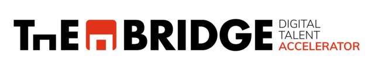

# 🚀 Desarrollo Web Full Stack · Online | Oct_24

> **Stack MERN** · MongoDB · Express · React · Node.js  
> *De cero a desarrollador Full Stack*

---

## 🎯 ¿Qué vas a aprender?

- Crear interfaces de usuario **atractivas y responsivas**
- Dominar el **Frontend y el Backend** desde cero
- Gestionar **bases de datos** relacionales (SQL) y no relacionales (MongoDB)
- Construir y consumir **APIs REST**
- Escribir **tests** como un profesional
- **Desplegar** aplicaciones reales en producción

**Tecnologías:** `HTML` · `CSS` · `JavaScript ES6+` · `Node.js` · `Express` · `React` · `MongoDB` · `SQL` · `Jest` · `Git`

---

## 🗺️ Navegación rápida

| Bloque | Sprints | Tecnologías |
|--------|---------|-------------|
| [🟡 Ramp Up](#-ramp-up) | Sprint 1–2 | HTML, CSS, JS Básico |

---

## 📚 Temario completo

### 🟡 Ramp Up

<strong>🚀 Sprint 1 · HTML y CSS</strong>

### [HTML Fundamentos](./01_Ramp_Up/01_html/)
- Lenguaje de marcado y lado del cliente
- Encabezados, párrafos, formato de texto, citas, listas, comentarios
- Enlaces, tablas y etiquetas multimedia
- Formularios y etiquetas semánticas

### [CSS](./01_Ramp_Up/02_css/)
**1. Introducción a CSS**
- ¿Qué es CSS? · Conectando HTML y CSS
- Selectores, modelo de cajas y posición
- Display & Flexbox

**2. Flexbox y Media Queries**
- Mobile first y media queries
- Transform, transiciones y animaciones

<strong>🚀 Sprint 2 · JS Fundamentos</strong>

### [JS Fundamentos](./01_Ramp_Up/03_js/)

- Variables y tipos de datos
- Operadores, Arrays y Bucles
- Funciones, Condicionales y Objetos

---

## 🎓 Clases de Refuerzo

### 🎨 Mejora Planet Skin

> Repaso de maquetación y estilos aplicados a un proyecto real.

| Recurso | Enlace |
|---------|--------|
| Repositorio | [planet-skin-available](https://github.com/CarlosDiazGirol/planet-skin-available) |
| Grabación | [Ver en Google Drive](https://drive.google.com/file/d/19TQaDeFDbaKZFTyxBns6Tu0ywzXOLSUF/view?usp=sharing) |

---

### 🏗️ Proyecto MVP

> Construye tu primer producto mínimo viable de principio a fin.

| Recurso | Enlace |
|---------|--------|
| Presentación | [Ver slides](https://docs.google.com/presentation/d/1m8_m5Y4OCYsVkZy-txovh1b409eD2M_Wz4piqa17GBo/edit?usp=sharing) |
| Grabación | [Ver en YouTube](https://youtu.be/85ktueh7Wi4) |
| Ejemplo de Briefing | [Abrir documento](https://docs.google.com/document/d/1KAGi8JsgM_rENFEFmpTrRpfIQQI8S5_CxPOWCtxk9nI/edit?hl=es&tab=t.0) |
| Wireframes | [Figma](https://www.figma.com/) |
| Pasarela de pago | [Stripe](https://stripe.com/) |

---
